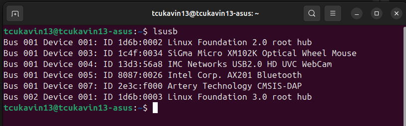

Устанавливаем ARM toolchain:<br>
```$ sudo apt install gcc-arm-none-eabi```<br> 
```$ sudo apt install binutils-arm-none-eabi```<br>
<br>
Устанавливаем отладчик GDB:<br>
```$ sudo apt install gdb-multiarch```<br>
<br>
Чтобы иметь возможность выполнять команду ```arm-none-eabi-gdb``` после установки **gdb-multiarch** необходимо добавить следующую символическую ссылку:<br>
```ln -s /usr/bin/gdb-multiarch /usr/bin/arm-none-eabi-gdb```<br>
<br>
Устанавливаем OpenOCD.<br>
Скачиваем с оффициального сайта архив с пакетом ArteryIDE и копируем оттуда папку OpenOCD в произвольное место на файловую систему. Затем, чтобы OpenOCD можно было запускать из произвольного места короткой командой ```openocd```, добавляем символическую ссылку в каталог поиска программ - ```/usr/bin```:<br>
```sudo ln -s /home/tcukavin13/OpenOCD/bin/openocd /usr/bin/```<br>
<br>
В **launch.json** прописываем пути поиска зависимостей пакета openocd:<br>
 ```"searchDir": [ "/home/tcukavin13/OpenOCD/scripts" ]```<br>
 <br>
В качестве генератора CMake в файле **CMakePresets.json** задаём ```Unix Makefiles```:<br> 
```"generator": "Unix Makefiles"```<br>
<br>
В Linux разрешение на доступ к USB-устройствам из пользовательского пространства должно быть явно предоставлено через правила udev. Чтобы получить доступ к отладчику AtLink без необходимости запуска OpenOCD от имени root, что крайне не рекомендуется, необходимо добавить правила в каталог ```/etc/udev/rules.d/```:<br>
```$ sudo cp atlink.rules /etc/udev/rules.d```<br>
<br>
**atlink.rules** содержит строку:<br>
```SUBSYSTEMS=="usb", ATTRS{idVendor}=="2e3c", ATTRS{idProduct}=="f000",\```<br>```MODE:="0666"```<br>
VID и PID USB-устройства можно посмотреть выполнив команду ```lsusb``` с подключенным USB программатором/отладчиком AtLink.<br>
<br><br>
Из картинки выше видно, что для AtLink, VendorID = 0x2e3c, ProductID = 0xf000.